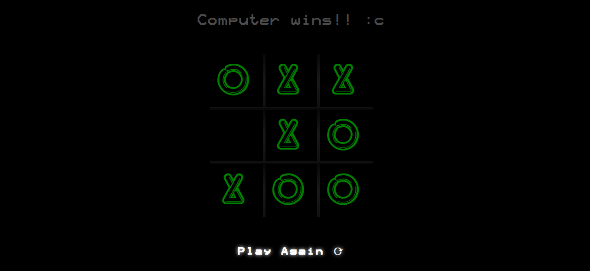

# tic-tac-toeJS

A simple implementation of a tic-tac-toe game using JS and playable on the browser.

## Table of Contents

* [About the Project](#about-the-project)
  * [Built With](#built-with)
* [Contact](#contact)
* [Acknowledgements](#acknowledgements)

<!-- ABOUT THE PROJECT -->
## About The Project

In this Tic Tac Toe game you can play against an unbeatable AI built purely with JavaScript.
Test your skills!!

Link for project specifications: [Odin-Project](https://www.theodinproject.com/courses/javascript/lessons/tic-tac-toe-javascript)

### Built With

*   HTML5 - Web Structure
*   CSS3 - Cascade Style Sheets
*   Bootstrap4 - Positioning
*   JavaScript - Behaviour

<!-- CONTACT -->
## Contact

Guadalupe Rangel - kanemekanik@gmail.com

Mario Dena - mario_dena@outlook.com

<!-- ACKNOWLEDGEMENTS -->
## Acknowledgements

* [Microverse](https://www.microverse.org/)
